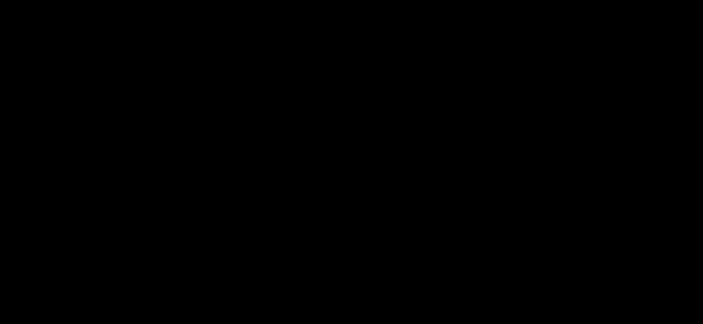

# Attributable Visual Similarity Learning

[](https://paperswithcode.com/sota/metric-learning-on-cars196?p=attributable-visual-similarity-learning)
[](https://paperswithcode.com/sota/metric-learning-on-cub-200-2011?p=attributable-visual-similarity-learning)
[](https://paperswithcode.com/sota/metric-learning-on-stanford-online-products-1?p=attributable-visual-similarity-learning)

This repository is the official PyTorch implementation of **Attributable Visual Similarity Learning** (CVPR 2022). [](https://arxiv.org/abs/2203.14932)

This paper proposes an attributable visual similarity learning (AVSL) framework for a more accurate and explainable similarity measure between images. 
Extensive experiments on the CUB-200-2011, Cars196, and Stanford Online Products datasets demonstrate significant improvements over existing deep similarity learning methods and verify the interpretability of our framework.

## Framework



## Datasets 

### CUB-200-2011

Download from [here](http://www.vision.caltech.edu/visipedia/CUB-200-2011.html).

Organize the dataset as follows:

```
- cub200
    |- train
    |   |- class0
    |   |   |- image0_1
    |   |   |- ...
    |   |- ...
    |- test
        |- class100
        |   |- image100_1
        |   |- ...
        |- ...
```

### Cars196

Download from [here](http://ai.stanford.edu/~jkrause/cars/car_dataset.html).

Organize the dataset as follows:

```
- cars196
    |- train
    |   |- class0
    |   |   |- image0_1
    |   |   |- ...
    |   |- ...
    |- test
        |- class98
        |   |- image98_1
        |   |- ...
        |- ...
```

### Stanford Online Products

Download from [here](https://cvgl.stanford.edu/projects/lifted_struct/).

Organize the dataset as follows:

```
- online_products
    |- images
    |   |- bicycle_final 
    |   |- chair_final
    |   |- ...
    |- Info_Files
        |- Ebay_final.txt
        |- Ebay_info.txt
        |- ...
```

## Requirements

To install requirements:

```setup
pip install -r requirements.txt
```

## Training

### Baseline models 

To train `resnet50` on `Cars196` with `ProxyAnchor-baseline`, run this command as follows:

```python
python examples/demo.py --data_path <path-to-data> --save_path <path-to-log> --device 0 --batch_size 180 --test_batch_size 180 --setting proxy_anchor --embeddings_dim 512 --proxyanchor_margin 0.1 --proxyanchor_alpha 32 --num_classes 98 --wd 0.0001 --gamma 0.5 --step 10 --lr_trunk 0.0001 --lr_embedder 0.0001 --lr_collector 0.01 --dataset cars196 --model resnet50 --delete_old --save_name proxy-anchor-resnet50-cars196-baseline --warm_up 5 --warm_up_list embedder collector
```

For more baseline settings, please refer to [`samples_baseline`](examples/samples_baseline.sh).

### Our models

To train `resnet50` on `Cars196` with `ProxyAnchor-AVSL`, run this command as follows:

```python
python examples/demo.py --data_path <path-to-data> --save_path <path-to-log> --device 0 --batch_size 180 --test_batch_size 180 --setting avsl_proxyanchor --feature_dim_list 512 1024 2048 --embeddings_dim 512 --avsl_m 0.5 --topk_corr 128 --prob_gamma 10 --index_p 2 --pa_pos_margin 1.8 --pa_neg_margin 2.2 --pa_alpha 16 --final_pa_pos_margin 1.8 --final_pa_neg_margin 2.2 --final_pa_alpha 16 --num_classes 98 --use_proxy --wd 0.0001 --gamma 0.5 --step 5 --dataset cars196 --model resnet50 --splits_to_eval test --warm_up 5 --warm_up_list embedder collector --loss0_weight=1 --loss1_weight=4 --loss2_weight=4 --lr_collector=0.1 --lr_embedder=0.0002 --lr_trunk=0.0002 \
--save_name proxy-anchor-resnet50-cars196-avsl
```

For more AVSL settings, please refer to [`samples_avsl`](examples/samples_avsl.sh).

## Device 

We tested our code on a linux machine with an Nvidia RTX 3090 GPU card. We recommend using a GPU card with a memory > 16GB.

## Results

Results on CUB-200-2011:

| Model name | Recall @ 1 | Recall @ 2 | Recall @ 4 | Recall @ 8 |
| - | - | - | - | - |
| baseline-PA | 69.7 | 80.0 | 87.0 | 92.4 |
| AVSL-PA | 71.9 | 81.7 | 88.1 | 93.2 |

Results on Cars196:

| Model name | Recall @ 1 | Recall @ 2 | Recall @ 4 | Recall @ 8 |
| - | - | - | - | - |
| baseline-PA | 87.7 | 92.9 | 95.8 | 97.9 |
| AVSL-PA | 91.5 | 95.0 | 97.0 | 98.4 |

Results on Stanford Online Products:

| Model name | Recall @ 1 | Recall @ 10 | Recall @ 100 |
| - | - | - | - |
| baseline-PA | 78.4 | 90.5 | 96.2 |
| AVSL-PA | 79.6 | 91.4 | 96.4 |

## Bibtex

```
@article{zhang2022attributable,
  title={Attributable Visual Similarity Learning},
  author={Borui Zhang and Wenzhao Zheng and Jie Zhou and Jiwen Lu},
  journal={arXiv preprint arXiv:2203.14932},
  year={2022}
}
```
